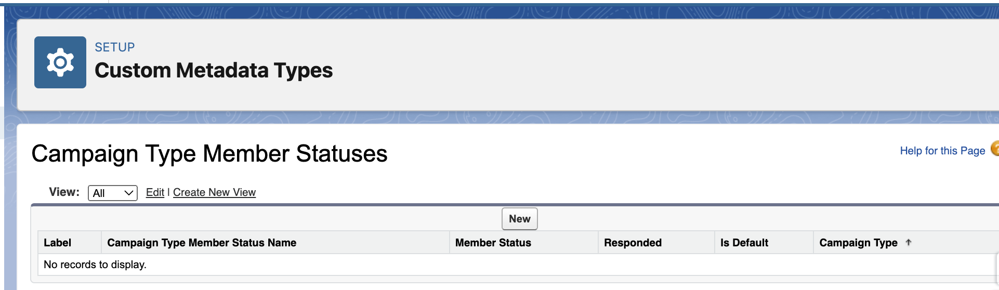
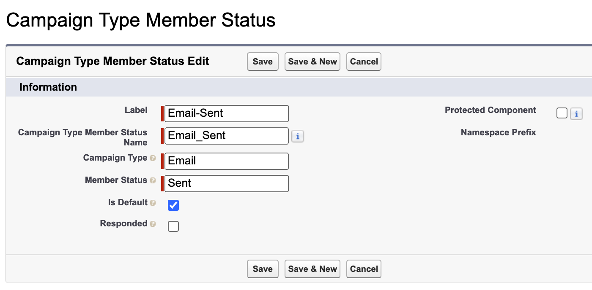
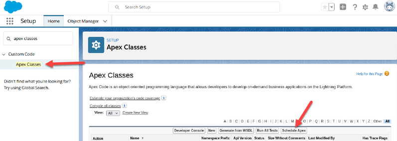
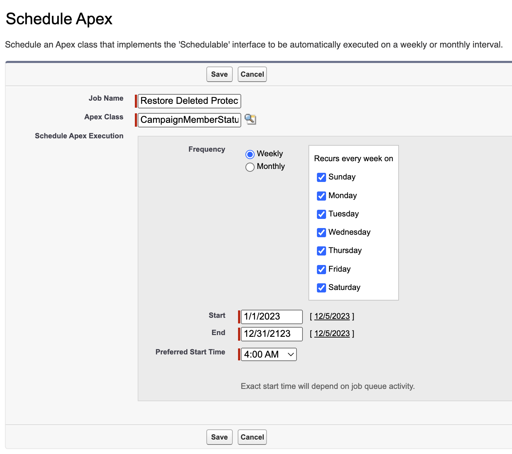

[](https://github.com/dschach/campaign-member-status/actions/workflows/pr.yml)
[](https://github.com/dschach/campaign-member-status/actions/workflows/ci.yml)
[](https://github.com/dschach/campaign-member-status/actions/workflows/release-please.yml)

# Campaign Type Member Statuses

**[Changelog](CHANGELOG.md)**

This code was developed for Marketing Admins who want to automate and enforce the Campaign Member Status options for Campaigns of certain types. It was originally written by [Sercante LLC](https://github.com/sercante-llc/protected-campaign-statuses).

> This application is designed to run on the Salesforce Platform

- [Campaign Type Member Statuses](#campaign-type-member-statuses)
- [A solution for Campaign Type Member Statuses and step-by-step instructions for use.](#a-solution-for-campaign-type-member-statuses-and-step-by-step-instructions-for-use)
  - [Originally written by Adam Erstelle](#originally-written-by-adam-erstelle)
  - [**Campaign Type Member Statuses**](#campaign-type-member-statuses-1)
- [Installation Instructions](#installation-instructions)
  - [What You Get](#what-you-get)
  - [Get started](#get-started)
- [**That's cool.** **What's behind the curtain?**](#thats-cool-whats-behind-the-curtain)
- [How it Works](#how-it-works)
  - [New Campaign Created](#new-campaign-created)
  - [Editing a Campaign Type Member Status](#editing-a-campaign-type-member-status)
  - [Removing a Campaign Type Member Status](#removing-a-campaign-type-member-status)
- [FAQ](#faq)
  - [Do you have any suggested statuses?](#do-you-have-any-suggested-statuses)
  - [Why Don't you just prevent people from messing around with Protected Statuses?](#why-dont-you-just-prevent-people-from-messing-around-with-protected-statuses)
  - [I get Apex test errors after deploying the code. How can I fix them?](#i-get-apex-test-errors-after-deploying-the-code-how-can-i-fix-them)
- [Pushing Code to a Sandbox](#pushing-code-to-a-sandbox)
- [Installing into a Scratch Org](#installing-into-a-scratch-org)

# A solution for Campaign Type Member Statuses and step-by-step instructions for use.

## Originally written by [Adam Erstelle](https://thespotforpardot.com/author/adamsercante-com/)

We go through all the effort of setting up beautiful Salesforce Campaigns, naming standards and maybe even a hierarchy. The next challenge in completing your beautiful work of campaign art is getting a hold on your Campaign Member Statuses for each campaign.

When a new Salesforce Campaign is created, many people aren't just happy with the two default statuses of Sent and Responded. This prompts them to create what they think makes the most sense. Though as time goes on and as reporting starts to be needed, everyone making their own Campaign Member Statuses can be a nightmare that prevents you from getting meaningful and actionable intelligence. It would be really nice to take the guesswork out of status reporting and have a standard set of Campaign Member Statuses everyone uses consistently.

Jenna Molby posted a [fantastic solution](https://jennamolby.com/how-to-automatically-create-campaign-statuses-in-salesforce/) that enables you to automatically create the right Statuses on Campaign creation. The automation here is good, though as you increase the number of Types the Flow could become a bit unwieldy.

Another thing that could be a problem comes later when other people might make changes to your carefully crafted structure. What happens if someone edits or even removes these statuses?

This code was developed for Marketing Admins who want to automate and enforce the Campaign Member Status options for Campaigns of certain types. It was originally written by Sercante LLC (https://github.com/sercante-llc/protected-campaign-statuses).

## **Campaign Type Member Statuses**

Campaign Type Member Statuses is a solution to solve this problem of automating (and enforcing) Campaign Member Statuses by Type. It allows you to:

1.  Define the Campaign Member Statuses that should always be present on given Campaign Types.
2.  Restore the Protected Statuses on Active Campaigns should someone make changes.
3.  Create additional Statuses for specific reasons.
4.  Override by authorized users on a per-Campaign basis.

# Installation Instructions

- [Pushing Code to a Sandbox](#pushing-code-to-a-sandbox)
- [Installing into a Scratch Org](#installing-into-a-scratch-org)

## What You Get

When deploying this package to your org, you will get:

- 1 Custom Metadata Type (and page layout)
- 1 Campaign Custom Field
- 1 ChangeDataCapture configuration
- 2 Apex Triggers
- 5 Production Apex Classes
- 4 Apex Test Classes

## Get started

If you install only the core code or the unlocked package, then you will not have any triggers installed.

1.  Deploy the main directory

    ```bash
    sf project deploy start --source-dir force-app
    ```

2.  You need to update your existing handlers or create new ones for the following objects and contexts.

    Log in to Salesforce, and go to Setup. Or create/update the triggers with the IDE of your choice:

    | **Object**                      | **Context**   | **Apex code**                                              |
    | ------------------------------- | ------------- | ---------------------------------------------------------- |
    | CampaignMemberStatusChangeEvent | after insert  | `new CMS_MemberStatusEventTriggerHandler().afterInsert();` |
    | Campaign                        | before insert | `new CMS_CampaignTriggerHandler().beforeInsert();`         |
    | Campaign                        | after insert  | `new CMS_CampaignTriggerHandler().afterInsert();`          |
    | Campaign                        | before update | `new CMS_CampaignTriggerHandler().beforeUpdate();`         |

Sample code is included in [unpackaged/triggers-sample/triggers](https://github.com/dschach/campaign-member-status/unpackaged/triggers-sample/triggers)

Next, you need to define your Protected Statuses. This is done with Custom Metadata Types.

1.  Log in to Salesforce, and go to Setup.
2.  Navigate to Custom Metadata Types, and click Manage Records for Campaign Type Member Status.

    

3.  To create your first ones, click New

    

4.  Fill in the various fields.

    - `Label`: Used in the List of Campaign Statuses in the Setup view in step 3 above. Recommended convention:  TYPE-STATUS
    - `Name`: This is an API name that can be used by developers. Not required by this package. Recommended: let this autofill after you type in the Label.
    - `Campaign Type`: This is the actual value for the Campaign's Type field.
    - `Protected Status`: This is the Status value that will become protected.
    - `Is Default`: Select this if this Status should be the default (please pick only 1 per Type).
    - `Is Responded`: Select this if this Status should be marked as Responded.
    - When complete, your screen may look something like this:

      

5.  Click `Save` (or `Save & New`) and repeat a whole bunch.
6.  Lastly, time to set up a scheduled job to restore deleted protected statuses.
7.  Back in Setup, go to Apex Classes and click `Schedule Apex`.

    

8.  Fill in the few fields.

    - `Job Name`: give this a nice descriptive name so you remember what it is in 3 months.
    - `Apex Class`: CampaignMemberStatusJob
    - `Frequency`: set this to what works for you. We recommend running this daily during off-peak hours.
    - `Start`: today
    - `End`: some time in the distant future
    - `Preferred Start Time`: off peak hours
    - When complete, your screen may look something like this:

      

You are good to go once you have provided your statuses. Give it a whirl by creating a new Campaign with the Type you have set up. Then take a look at the statuses already created.

Campaigns with Types not already set up will keep the default two statuses that Salesforce creates.

There's no need to add the new checkbox field on Campaign to page layouts, but if you want to, it's best to make it read-only.

# **That's cool.** **What's behind the curtain?**

To accomplish this, we leverage a few cool tools available to us:

- Custom Metadata Types: Allows the Protected Statuses to be treated like normal Salesforce metadata and can be deployed around like any other metadata (changesets, insert devops tool here)
- Campaign Custom Field: `Campaign.Has_Protected_Campaign_Member_Statuses__c` is automatically checked by the solution if a Campaign is created and there are Custom Metadata Type records that specify this Campaign's Type. It is also what allows the rest of the code to keep the statuses intact. You can clear the checkbox for this field to make changes to the statuses if you need to. However, you can't enable protection afterwards.
- Change Data Capture: We turn this on for CampaignMemberStatus so we can detect edits to statuses and then fix the records after-the-fact. Sadly we can't (yet?) put any triggers on CampaignMemberStatus (which would have been ideal).
- Triggers: We use them to kick off the automation that we've built when a Campaign is created. We also use them to watch for Campaign Member Status edits (through the ChangeEvents from Change Data Capture) so we can set things right afterwardsd.

If you want even more details, check out the [original Github project](https://github.com/sercante-llc/protected-campaign-statuses) where you can see all the inner workings of what is going on.

# How it Works

Once everything is set up, Campaigns should maintain a consistent set of Campaign Member Statuses. Here's how we accomplish that.

## New Campaign Created

When a new Campaign is created, we check to see if the Type of Campaign is defined in any of the Protected Campaign Member Status records (the Custom Metadata Type that was set up earlier). If there is a match, the solution will:

1. Automatically add a checkbox to the Campaign Custom Field "Has Campaign Type Member Statuses".
1. Automatically adjust the CampaignMemberStatus records to match all Campaign Type Member Statuses expected

## Editing a Campaign Type Member Status

For a Campaign that "Has Campaign Type Member Statuses", when one of the CampaignMemberStatus records is edited we will double check all statuses of that Campaign to make sure that all Protected ones still exist. If there are any missing, they will be recreated almost instantly (you may need to refresh the page for them to show up if there's a delay).

## Removing a Campaign Type Member Status

If a user removes a Campaign Type Member Status, the Scheduled Job (that was created as part of [Post-Install Configuration](#installation-instructions)) will search for Campaigns missing a Status and recreate it.

# FAQ

## Do you have any suggested statuses?

Of course! Here are a few to get your creative juices flowing.


## Why Don't you just prevent people from messing around with Protected Statuses?

We really wish we could. A "before update" and "before delete" Apex Trigger would be the simplest way to handle this. Unfortunately, Apex Triggers are not (yet) possible on CampaignMemberStatus records, so we end up having to fix it after-the-fact.

## I get Apex test errors after deploying the code. How can I fix them?

If you have Apex tests which set up a Campaign record as part of the test, the functionality in this package will get called and might blow up. This is because how Salesforce internally treats the automatic generation of Campaign Member Status records when a new Campaign is created (it's weird).

You have 2 options:

1. Use your trigger framework to bypass your Campaign Trigger Handler
1. To actually see the records that Salesforce would create, you would need to have your test `@isTest(seeAllData=true)`. There are a lot of considerations with this approach, so please use wisely.

# Pushing Code to a Sandbox

Follow this set of instructions if you want to deploy the solution into your org without using an Unlocked Package. This will require a Sandbox, and then a ChangeSet to deploy into Production.

1. If you know about and use `git`, clone this repository

   ```bash
   git clone https://github.com/dschach/campaign-member-status.git
   cd campaign-member-status
   ```

1. Set up your environment

   - [Install Salesforce CLI](https://developer.salesforce.com/docs/atlas.en-us.sfdx_setup.meta/sfdx_setup/sfdx_setup_install_cli.htm)

   - or [install from npm](https://www.npmjs.com/package/sfdx-cli)
     ```bash
     npm install @salesforce/cli --global
     ```

1. Authorize your Salesforce org and provide it with an alias (**myorg** in the commands below)

   ```
   # Connect your project to a Sandbox Org
   sf org login web --set-default --alias myorg --instance-url https://test.salesforce.com

   # with orgs that require a specific MyDomain URL, use this slightly altered command, making the correct adjustments
   sf org login web --set-default --alias myorg --instance-url https://mucustomdomain.my.salesforce.com
   ```

1. Run a series of commands to deploy each of the three parts, or skip to the next item to push them all at once

   Run this command in a terminal to deploy just the main code

   ```bash
   sf project deploy start --source-dir force-app
   ```

   Run this command in a terminal to deploy the included sample triggers

   ```bash
   sf project deploy start --source-dir unpackaged/triggers-sample
   ```

   Run this command in a terminal to deploy the bundled sample custom metadata

   ```bash
   sf project deploy start --source-dir unpackaged/email-sample
   ```

1. Or just run one command to push all three parts together

   ```bash
   sf project deploy start
   ```

1. You'll need a custom permission set to access the Campaign field, or just add it to an existing permission set and delete this one

   ```bash
   sf org assign permset --name Campaign_Type_Member_Status_Admin
   ```

1. Continue with [Post-Install Configuration](#get-started)

# Installing into a Scratch Org

1. Set up your environment. The steps include:

   - Enable Dev Hub in your main org
   - [Install Salesforce CLI](https://developer.salesforce.com/docs/atlas.en-us.sfdx_setup.meta/sfdx_setup/sfdx_setup_install_cli.htm)

1. If you haven't already done so, authorize your hub org and provide it with an alias (**myhuborg** in the command below):

   ```bash
   sf login org --set-default-dev-hub --alias myhuborg
   ```

1. If you know about and use git, clone this repository

   ```bash
   git clone https://github.com/dschach/campaign-member-status.git
   cd campaign-member-status
   ```

1. Run the included script to create a scratch org and push the metadata

   ```bash
   . scripts/campaignmember-scratchorg.sh
   ```

1. Continue with [Post-Install Configuration](#get-started)
